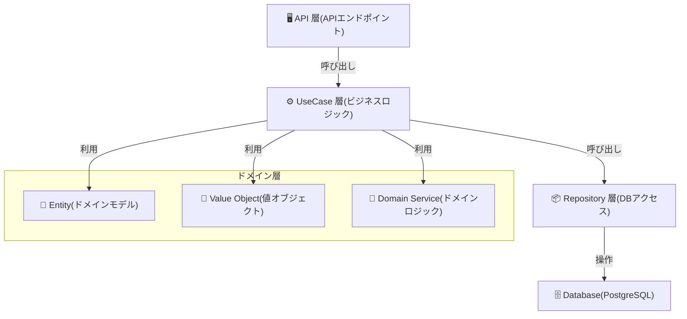

# アプリ開発

## Overview

- 謎解きのプラットフォームのwebアプリ

## 技術スタック

| 技術          | バージョン            |
|-------------|------------------|
| jdk         | amazon-correto21 |
| postgres    | 17               |
| Spring Boot | 3.4.3            |

## ディレクトリ構成

### 全体構成

```
app
 ├─docs               # アプリのドキュメント群
 ├─src                # ソースコード
 ├─docker-compose.yml # DBのコンテナ設定
 └─README             # 本ドキュメント
```

### ソースコード構成

```
src
 └─main
    ├─kotlin/jp/mentor/app
    │   ├─api
    │   │  ├─controller   # コントローラ群
    │   │  ├─docs         # コントローラのドキュメント群
    │   │  ├─exception    # 例外群
    │   │  ├─request      # リクエスト群
    │   │  └─response     # レスポンス群
    │   │
    │   ├─application
    │   │  ├─command      # コマンド群
    │   │  └─usecase      # ユースケース群
    │   │
    │   ├─domain
    │   │  ├─model        # モデル群
    │   │  ├─repository   # ドメインのリポジトリ群
    │   │  ├─service      # ドメインサービス群
    │   │  └─value        # 値オブジェクト群
    │   │
    │   └─infra           # 外部アクセス群
    │
    └─resources
        ├─db/migration    # マイグレーション
        └─application.yml # アプリケーションの設定ファイル
```

## アーキテクチャ図

DDDに準拠したアーキテクチャを採用しています。



## 環境構築

1. `Docker Desktop`などを起動
2. `docker-compose up --build`で初回起動
3. アプリケーションの起動（下記のいずれかで起動）
    - `src/main/kotlin/jp/mentor/app/AppApplication.kotlin`を起動
    - ターミナルで`./gradlew bootrun`

## データベースへのアクセス

- ローカルからのアクセス（ローカルにpsqlコマンドが入っている前提）
    - `psql -U postgres -d app -p 5433`
- コンテナ内でアクセス
    - `docker exec -it postgres_container bash`でコンテナ内に入る
    - `psql -U postgres -d app -p 5432`でデータベース内に入る

## マイグレーションに関して

- 本システムでは Flyway を用いてデータベースのマイグレーションを管理します。Flyway は SQL スクリプトをバージョン管理し、データベースのスキーマを順番に更新します。
- Flyway を Gradle で実行する方法は以下の通りです。

### flywayコマンド実行の流れ

1. `src/main/resources/db/migration`配下にsqlファイルを作成します。ファイルの命名は、` V1__init.sql`、`V2__add_table.sql`のように バージョン番号と説明の形式で行います。
2. 以下のコマンドで。flywayを実行します。
    ```
    ./gradlew flywayMigrate
    ```

### flywayの注意点

- ファイル名が形式通りでないと動きません。
  - `V{バージョン番号}__{説明}.sql`
- flywayは実行済みのsqlファイルは変更しても動きません。新しいsqlファイルを作成する必要があります。
- `./gradlew flywayClean`というコマンドでDB内の全てのテーブルとデータが削除されます。これにより、実行済みのsqlファイルも未実行ファイルという扱いに戻ります。

## エンドポイント

### Swagger UI

- [Swagger UI](http://localhost:9090/manage/actuator/swagger-ui/index.html)