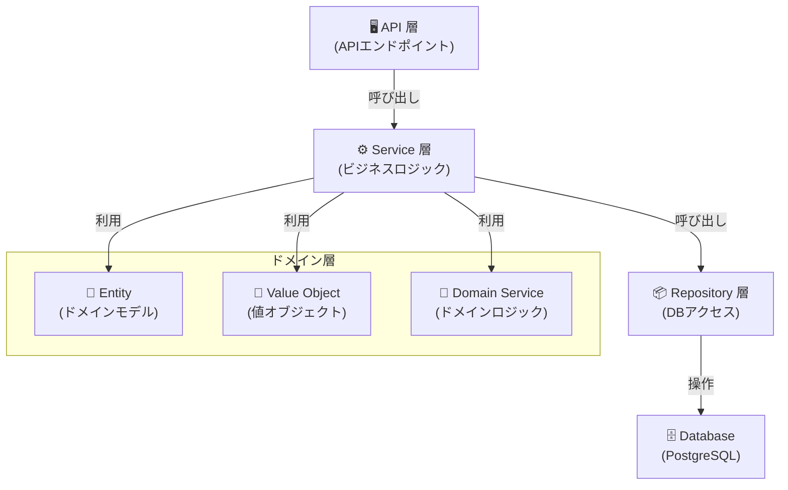

眠いので書けない

## アーキテクチャ図

```mermaid
graph TD;
    Controller["🖥️ API 層\n(APIエンドポイント)"] -->|呼び出し| Service["⚙️ Service 層\n(ビジネスロジック)"]
    Service -->|呼び出し| Repository["📦 Repository 層\n(DBアクセス)"]
    Repository -->|操作| Database["🗄️ Database\n(PostgreSQL)"]

    subgraph ドメイン層
        Entity["📄 Entity\n(ドメインモデル)"]
        ValueObject["📌 Value Object\n(値オブジェクト)"]
        DomainService["🔧 Domain Service\n(ドメインロジック)"]
    end

    Service -->|利用| Entity
    Service -->|利用| ValueObject
    Service -->|利用| DomainService
```