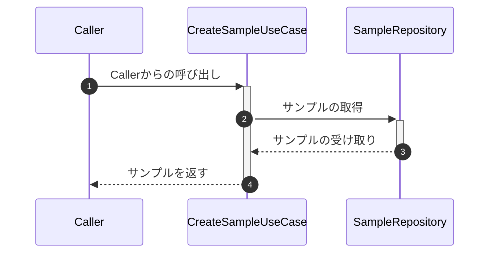

# GetSampleUseCase

## Overview

- Sampleを取得するユースケースです

## Field Params

| 型                | 説明                      |
|:-----------------|:------------------------|
| SampleRepository | `samples`テーブルを操作するリポジトリ |

## Method Params

| 名前 | 型   | 説明        |
|:---|:----|:----------|
| id  | Int | sampleのid |

## Return

| 型            | 説明                             |
|:-------------|:-------------------------------|
| SampleResult | サンプルエンティティの取得結果を表すデータクラス       |

## シーケンス図

