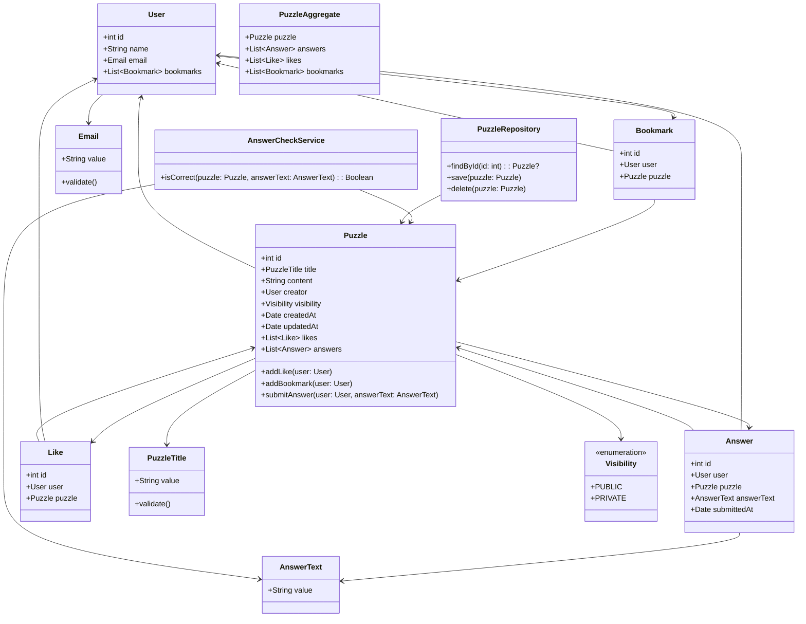

# ドメインまとめ

## 1. 概要
本ドキュメントでは、謎解きアプリのドメイン駆動設計（DDD）に基づくドメインモデルを定義します。

## 2. ドメインモデル
### 2.1 エンティティ（Entity）
#### **User（ユーザー）**
- **id**: ユーザーを一意に識別するid
- **name**: ユーザーの名前
- **email**: ユーザーのメールアドレス（値オブジェクト）
- **bookmarks**: ブックマーク（Bookmark）のリスト

#### **Puzzle（謎解き）**
- **id**: 謎解きを一意に識別するid
- **title**: 謎解きのタイトル（値オブジェクト）
- **content**: 謎解きの本文
- **creator**: 作成者（User）
- **visibility**: 公開範囲（列挙型）
- **createdAt**: 作成日時
- **updatedAt**: 更新日時
- **likes**: いいね（Like）のリスト
- **answers**: 回答（Answer）のリスト
- **メソッド**:
    - `addLike(user: User)`: いいねを追加
    - `addBookmark(user: User)`: ブックマークを追加
    - `submitAnswer(user: User, answerText: AnswerText)`: 回答を登録し、正解判定を行う

#### **Answer（回答）**
- **id**: 回答を一意に識別するid
- **user**: 回答者（User）
- **puzzle**: 対象の謎解き（Puzzle）
- **answerText**: 回答内容（値オブジェクト）
- **submittedAt**: 回答日時

#### **Like（いいね）**
- **id**: いいねを一意に識別するid
- **user**: いいねを押したユーザー（User）
- **puzzle**: いいねを押された謎解き（Puzzle）

#### **Bookmark（ブックマーク）**
- **id**: ブックマークを一意に識別するid
- **user**: ブックマークしたユーザー（User）
- **puzzle**: ブックマークされた謎解き（Puzzle）

### 2.2 値オブジェクト（Value Object）
#### **Email（メールアドレス）**
- **value**: メールアドレス文字列
- **制約**: `@` を含むこと

#### **PuzzleTitle（タイトル）**
- **value**: タイトル文字列
- **制約**: 1〜100文字

#### **AnswerText（回答テキスト）**
- **value**: 回答内容

#### **Visibility（公開範囲）**
- **PUBLIC**: 公開
- **PRIVATE**: 非公開

### 2.3 集約（Aggregate）
#### **PuzzleAggregate（謎解き集約）**
- **puzzle**: 謎解き（Puzzle）
- **answers**: 回答リスト（Answer）
- **likes**: いいねリスト（Like）
- **bookmarks**: ブックマークリスト（Bookmark）

### 2.4 ドメインサービス（Domain Service）
#### **AnswerCheckerService（回答チェックサービス）**
- **isCorrect(puzzle: Puzzle, answerText: AnswerText): Boolean**
- 謎解きの正解判定を行う

### 2.5 リポジトリ（Repository）
#### **PuzzleRepository（謎解きリポジトリ）**
- **findById(id: int): Puzzle?**: IDから謎解きを取得
- **save(puzzle: Puzzle)**: 謎解きを保存
- **delete(puzzle: Puzzle)**: 謎解きを削除

## 3. 関係図（Mermaid）
