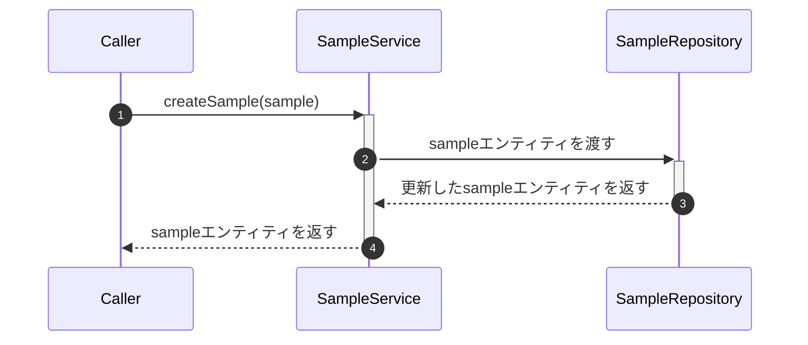

# createSample

## Overview

- sampleを作成するサービス。

## Params

| 引数      | 型 | 説明 |
|:--------| :--- | :---|
| sample  | Sample | sampleエンティティ|

## Return

- 更新したsampleエンティティ

## 処理の流れ
### シーケンス図

#### 補足